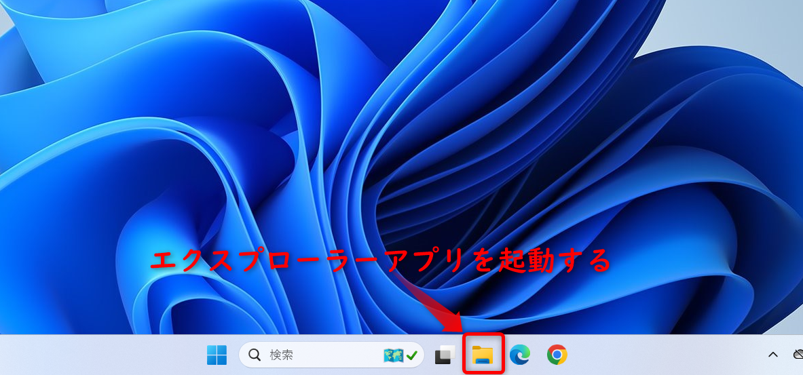
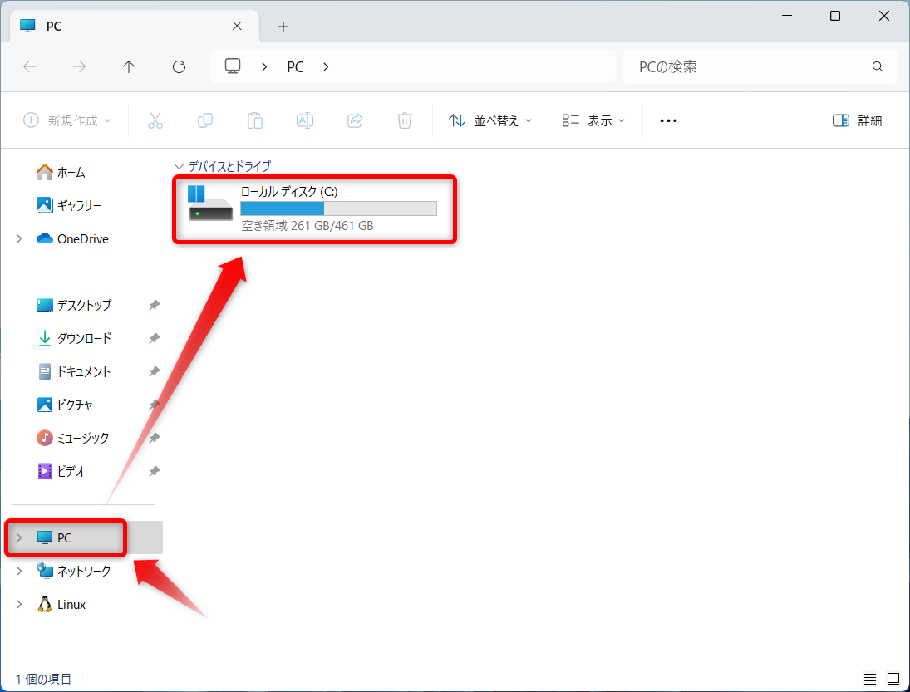
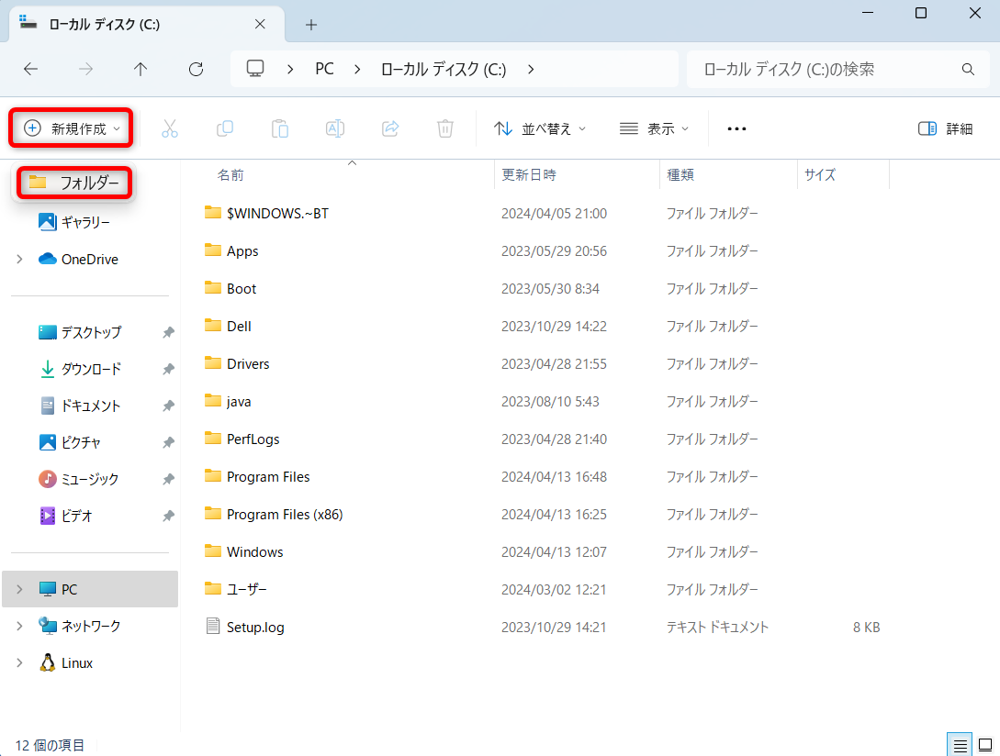
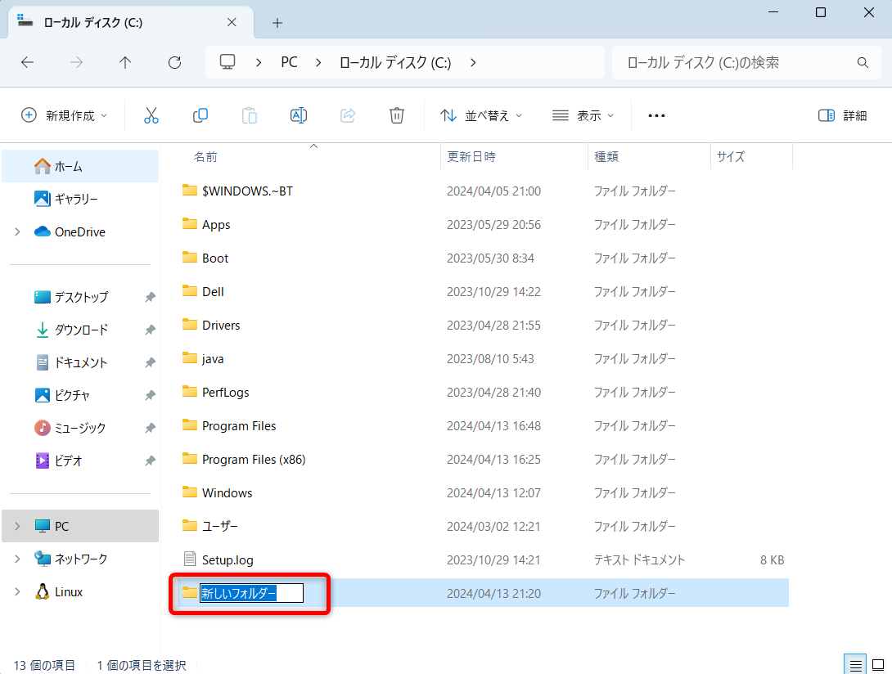
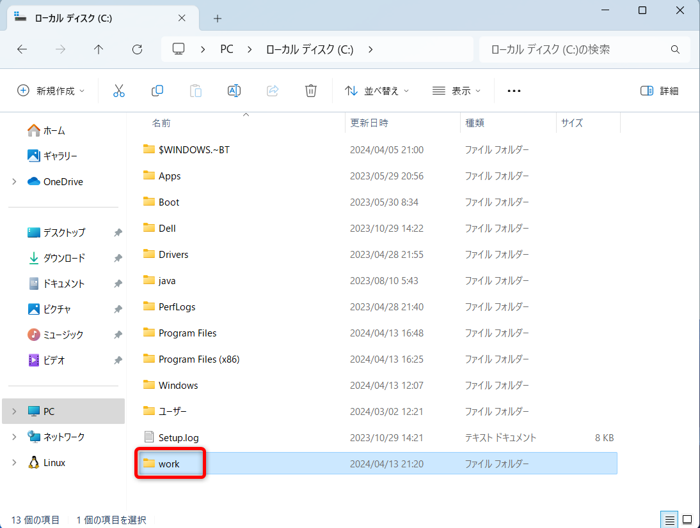
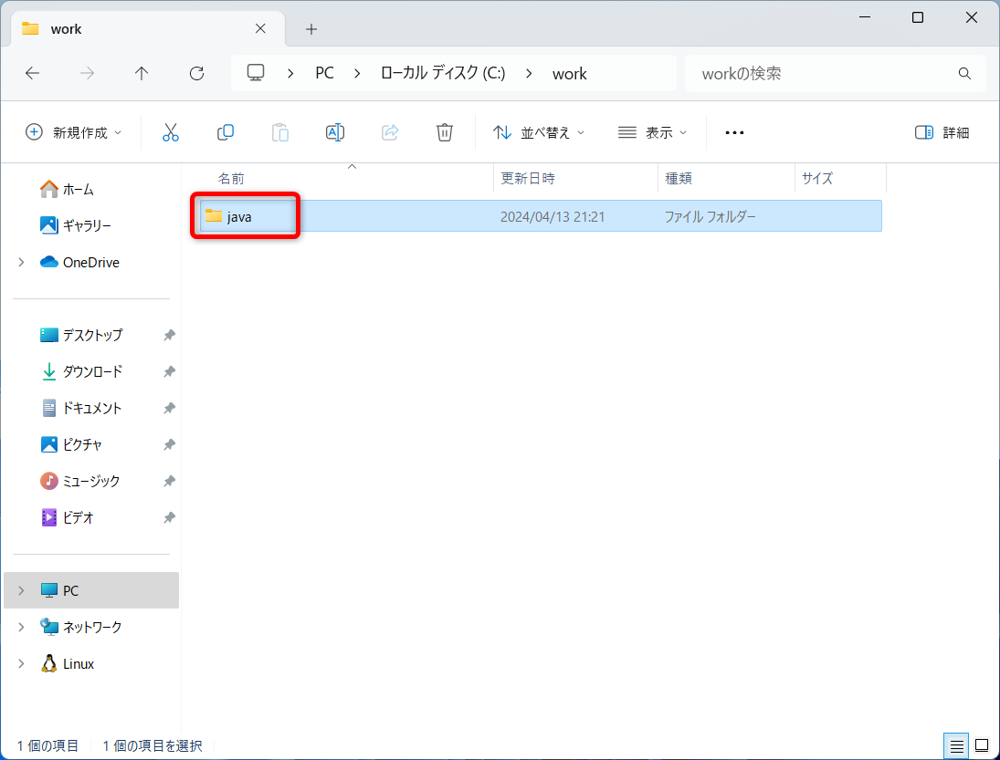
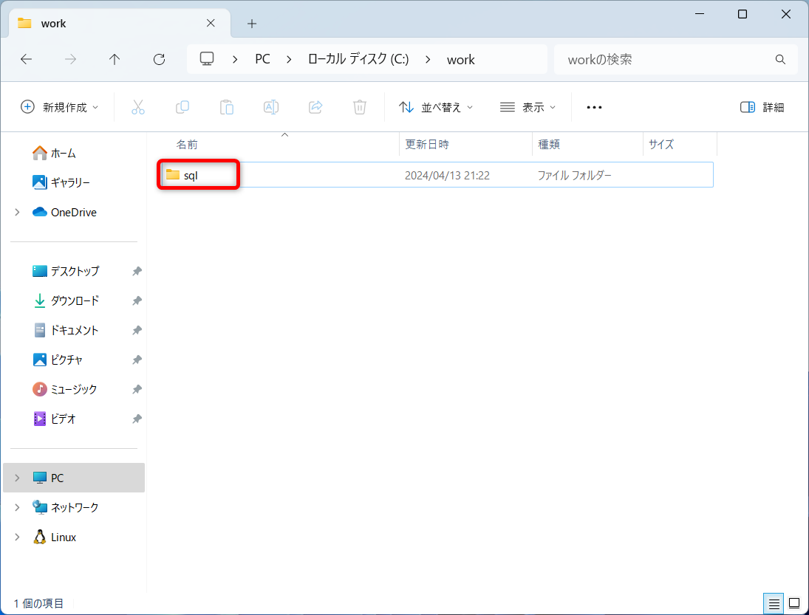

# workフォルダの準備

## Cドライブに授業用の`work`フォルダを作る

### Cドライブに移動する

Windowsの下側(タスクバー)にある`エクスプローラー`アプリを起動する  

左側の`PC`アイコンから`ローカルディスク(C:)`をダブルクリックして`Cドライブ`に入る  

### `work`フォルダを作る 

上部の`+ 新規作成`ボタンをクリックして、`フォルダー`をクリック  

フォルダーが新規作成されるので、フォルダー名を`work`とする

作成した`work`フォルダをダブルクリックして、フォルダの中に入る

## 授業ごとのフォルダを作成する

### Javaの場合

同じ手順で`C:\work`フォルダの中に`java`フォルダを作る

### SQLの場合

同じ手順で`C:\work`フォルダの中に`sql`フォルダを作る

